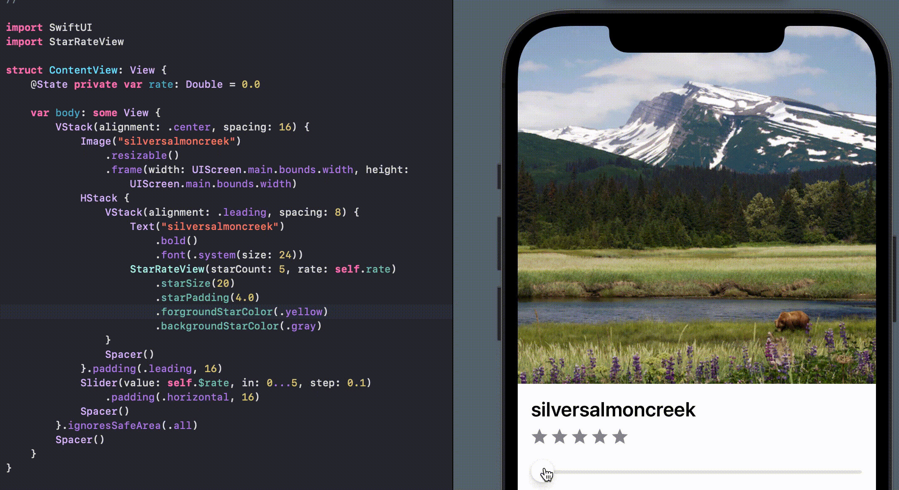

# StarRateView
StarRateView is a star rating library created in SwiftUI.
<p align="center">
    
    
    <a href="https://github.com/yotsu12/TagLayoutView/blob/master/LICENSE"></a>
</p>
<center>

</center>

## Usage
```swift
struct ContentView: View {
    @State var rate: Double = 2.5
    
    var body: some View {
        StarRateView(starCount: 5, rate: self.rate)
            .starSize(20)
            .starPadding(4.0)
            .forgroundStarColor(.yellow)
            .backgroundStarColor(.gray)
    }
}
```

## Installation

`StarRateView` is available via [Swift Package Manager](https://swift.org/package-manager).
go to `File -> Swift Packages -> Add Package Dependency` and enter [StarRate](https://github.com/giiiita/StarRateView)
